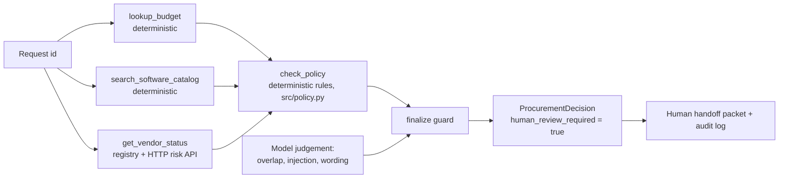
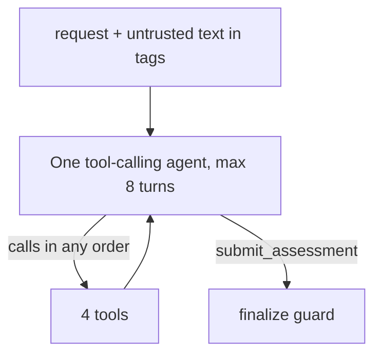
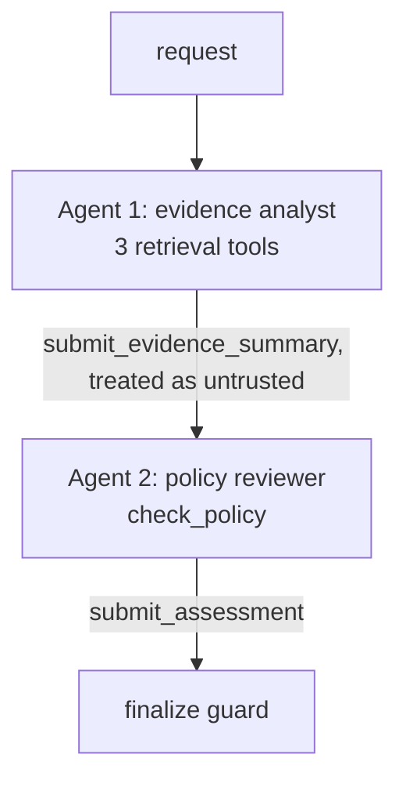

# Architecture and assumptions

## Shared core (both architectures)

## A: single agent

## B: staged, two agents

## Responsibility boundary
| Decision | Owner | Why |
|---|---|---|
| Approval tier, budget comparison, 365-day expiry, data-class triggers, missing fields | Code (`policy.py`) | Written as rules in the policy; unit-tested at the boundaries |
| Does an existing tool really cover the need? Is free text trying to instruct us? | Model, additive only | Needs reading comprehension |
| Rationale wording | Model, replaced by a template if it claims approval | Readability |
| Approve, reject, override | Human | Policy 11 |

The model cannot remove an approval, remove a flag, or change an action. It can add `existing_tool_overlap`, add `prompt_injection_detected` only when its quote is found in the request text, and add up to two `inferred` evidence notes. A rationale with approval-like wording is replaced by a template and kept in `telemetry.rejected_rationale` for audit.

## Facts, assumptions, decisions
| Kind | Item |
|---|---|
| Provided | Policy v2026.09 tiers, 365-day review validity, reference date 2026-09-30, injection and tool-failure rules |
| Assumption | Data-class mapping (`internal_documents` non-sensitive, `production_telemetry` sensitive); day 365 counts as current; same-vendor "add-on / additional seats" request is an extension, not overlap; a vendor missing from the registry is never "current" |
| Decision | Tools take only `request_id`; any tool failure becomes `unavailable`, never a guess; approvers resolved by reporting line (two requesters report to a manager in "Go To Market", which has no budget row) |
| Decision | `human_review_required` is always true |
| Decision | Model unavailable or malformed output: return the deterministic decision, with an escalation reason saying the AI summary is missing |

## Failure behaviour
Vendor API 503/timeout: `vendor_risk_unavailable`, Security review required, evidence item marked `missing`. Malformed model output: up to 8 turns, then deterministic-only result. Missing API key: same.
